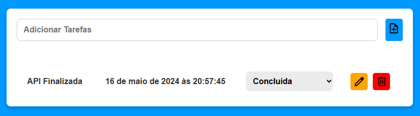

## Resumo geral da aplicação.

## API ToDoList Full Stack



Este projeto é composto por duas partes principais: o frontend, que é a interface do usuário para gerenciar a lista de tarefas, e o backend, que é a API responsável pelo gerenciamento dos dados das tarefas. Abaixo está um resumo das funcionalidades, estrutura e principais componentes de cada parte.

# Frontend

O frontend do aplicativo de lista de tarefas é responsável por fornecer uma interface amigável para os usuários adicionarem, visualizarem, editarem e excluírem tarefas. Aqui estão os detalhes:

# Estrutura HTML

Idioma e Codificação: Configurado para pt-br com UTF-8.

Estilos Externos: Inclui fontes do Google Fonts e um arquivo CSS local (style.css).

Título da Página: "Listas de tarefas".

Componentes Principais:

Formulário: Para adicionar novas tarefas.

Tabela: Para listar, editar e excluir tarefas existentes.

# Estilos CSS

## O arquivo style.css define a aparência da aplicação:

Fonte Principal: Urbanist do Google Fonts.

Estilos Básicos: Para o corpo, formulários, inputs, botões e tabela.

Estilos Interativos: Específicos para botões de ação e selects.

# Funcionalidades JavaScript

## O arquivo script.js contém a lógica para manipulação das tarefas:

fetchTasks: Busca as tarefas do servidor.

addTask: Adiciona uma nova tarefa ao servidor.

deleteTask: Remove uma tarefa do servidor.

updateTask: Atualiza uma tarefa existente no servidor.

loadTasks: Carrega e exibe as tarefas na tabela.

createElement: Cria elementos HTML dinamicamente.

createSelect: Cria um elemento select para o status das tarefas.

createRow: Cria uma linha na tabela para cada tarefa.

# Backend


## A API backend gerencia o armazenamento e manipulação dos dados das tarefas. Aqui estão os detalhes:

Funcionalidades Principais

Listar Todas as Tarefas: Endpoint para obter todas as tarefas cadastradas.

Criar Nova Tarefa: Endpoint para adicionar uma nova tarefa.

Excluir Tarefa: Endpoint para remover uma tarefa.

Atualizar Tarefa: Endpoint para atualizar os dados de uma tarefa existente.

# Estrutura do Projeto

## O projeto segue uma organização clara das pastas:

controllers: Contém os controladores que lidam com as requisições HTTP.

middlewares: Contém os middlewares para validação de dados.

models: Contém os modelos que representam os dados no banco de dados.

routes: Contém as definições das rotas da API.

src: Diretório raiz com os principais arquivos da aplicação.

# Configuração do Ambiente

## Antes de executar a aplicação, configure as variáveis de ambiente no arquivo .env:

PORT: Porta do servidor.

MYSQL_HOST: Host do servidor MySQL.

MYSQL_USER: Nome de usuário do MySQL.

MYSQL_PASSWORD: Senha do MySQL.

DB: Nome do banco de dados.

# Dependências Principais

cors: Permite comunicação segura entre diferentes origens.

dotenv: Carrega variáveis de ambiente.

express: Framework web para Node.js.

mysql: Cliente MySQL para Node.js.

mysql2: Cliente MySQL assíncrono para Node.js.

# Como Executar

## Para rodar a aplicação backend:

Instale as dependências:

```bash
npm install
```

Configure as variáveis de ambiente no arquivo .env
Execute o servidor Node.js:

```bash
npm start
```

## Contexto Geral

Este projeto de lista de tarefas é uma aplicação completa que permite aos usuários gerenciar suas tarefas diárias. O frontend oferece uma interface intuitiva para interação com o sistema, enquanto o backend fornece uma API robusta para manipulação e armazenamento dos dados. Juntos, eles formam uma solução eficiente e funcional para gerenciamento de tarefas, desde a criação até a conclusão.
