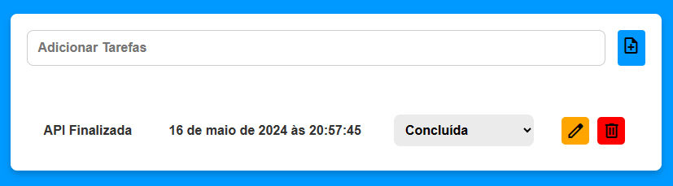

## Frontend Document

# Resumo do Frontend
Este repositório contém o código para a interface de um aplicativo de lista de tarefas. Abaixo está um resumo das funcionalidades e estrutura do frontend, incluindo HTML, CSS e JavaScript.

# Estrutura HTML
## O arquivo HTML principal (index.html) define a estrutura básica da aplicação:

Utiliza o idioma pt-br e codificação de caracteres UTF-8.

Inclui links para estilos externos do Google Fonts e um arquivo de estilo CSS local (style.css).

Define o título da página como "Listas de tarefas".

Contém um formulário para adicionar novas tarefas e uma tabela para listar as tarefas existentes.

Formulário de Adição de Tarefas

# Estilos CSS
## O arquivo style.css define o estilo visual da aplicação:

Utiliza a fonte Urbanist do Google Fonts.

Define estilos básicos para o corpo, formulário, inputs, botões e tabela.

Inclui estilos específicos para elementos interativos como botões de ação e selects.

# Funcionalidades JavaScript
## O arquivo script.js contém a lógica para manipulação das tarefas:

fetchTasks: Busca as tarefas do servidor.

addTask: Adiciona uma nova tarefa ao servidor.

deleteTask: Remove uma tarefa do servidor.

updateTask: Atualiza uma tarefa existente no servidor.

loadTasks: Carrega e exibe as tarefas na tabela.

createElement: Cria elementos HTML de forma dinâmica.

createSelect: Cria um elemento <select> para o status das tarefas.

createRow: Cria uma linha na tabela para cada tarefa.

# Como Usar

Clone o repositório.

Instale as dependências necessárias para o backend (se aplicável).

Inicie o servidor backend.

Abra o arquivo index.html no navegador para visualizar a aplicação.

Adicione, edite e remova tarefas conforme necessário.
